<div align="center">

# 🧠 LaporKita AI Service

<p align="center">
  
  
  
  
  
  
  
</p>

> **Microservice Python FastAPI** mandiri untuk platform **LaporKita** — platform pelaporan kerusakan infrastruktur publik **Kota Malang** berbasis AI.
>
> Menyediakan tiga kapabilitas AI/ML end-to-end: **Computer Vision verifikasi laporan**, **Urban Risk Prediction**, dan **Policy Impact Simulation** berbasis LLM.

</div>

---

## 📑 Daftar Isi

- [🌐 Gambaran Umum Platform](#-gambaran-umum-platform)
- [🏛️ Arsitektur Sistem](#️-arsitektur-sistem)
  - [Topologi Microservice](#topologi-microservice)
  - [Alur Data End-to-End](#alur-data-end-to-end)
  - [Alur Verifikasi AI](#alur-verifikasi-ai)
  - [Alur Prediksi Risiko](#alur-prediksi-risiko)
  - [Alur Policy Simulator](#alur-policy-simulator)
- [🧩 Teknologi Stack](#-teknologi-stack)
- [📁 Struktur Direktori Proyek](#-struktur-direktori-proyek)
- [🚀 Cara Menjalankan Lokal](#-cara-menjalankan-lokal-venv)
- [🐳 Cara Menjalankan dengan Docker](#-cara-menjalankan-dengan-docker)
- [⚙️ Environment Variables](#️-daftar-lengkap-environment-variables)
- [🔀 Routing & URL Mapping](#-routing--url-mapping-dual-prefix)
- [📡 Dokumentasi Lengkap Semua Endpoint](#-dokumentasi-lengkap-semua-endpoint)
  - [GET /health](#1-get-health)
  - [GET /demo & GET / — Interactive Web Console](#2-get-demo--get----interactive-web-console)
  - [POST /v1/verify — Canonical](#3-post-v1verify--canonical-envelope)
  - [POST /api/v1/verify — NestJS Compat](#4-post-apiv1verify--nestjs-compat-flat)
  - [POST /v1/predict-risk](#5-post-v1predict-risk)
  - [POST /v1/predict/zone-metrics](#6-post-v1predictzone-metrics--nestjs-compat)
  - [POST /v1/policy-simulate](#7-post-v1policy-simulate)
- [📐 Format Response Envelope](#-format-response-envelope-standar)
- [🚨 Error Codes & HTTP Status Reference](#-error-codes--http-status-reference)
- [📊 Dataset & Training](#-ringkasan-dataset-publik-5-kategori)
- [📈 Metrik Evaluasi Model](#-metrik-evaluasi-model-riil)
- [🏗️ Arsitektur Decision Log](#️-arsitektur-decision-log)
- [⚠️ Disclaimer & Known Limitations](#️-disclaimer--known-limitations-produksi)

---

## 🌐 Gambaran Umum Platform

LaporKita adalah platform **pelaporan kerusakan infrastruktur publik** berbasis AI untuk Kota Malang. Warga dapat melaporkan kerusakan jalan, drainase, lampu jalan, rambu lalu lintas, dan trotoar melalui aplikasi mobile. AI Service berperan sebagai **otak analitik** platform ini.

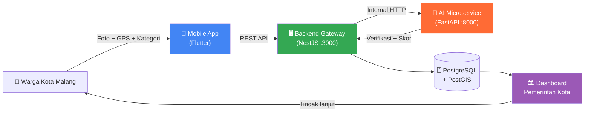

**Tiga Kapabilitas AI Utama:**

| # | Fitur | Model | Performa |
|---|---|---|---|
| 1 | 🔍 **AI Verification** | YOLOv11-cls (Computer Vision) | 99.23% Test Accuracy (Leak-Free Split) |
| 2 | 📊 **Urban Risk Prediction** | XGBoost Regressor | R² = 0.9635, RMSE = 0.0490 (Baseline Sintetis) |
| 3 | 🧬 **Policy Simulator** | DeepSeek API (LLM) | Structured JSON output, 20s timeout |

---

## 🏛️ Arsitektur Sistem

### Topologi Microservice

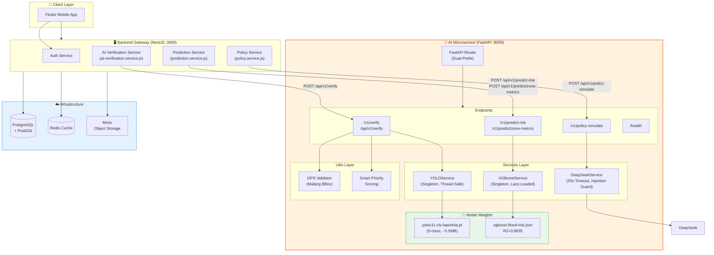

---

### Alur Data End-to-End

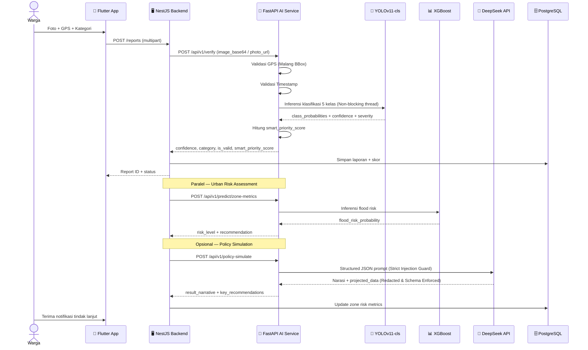

---

### Alur Verifikasi AI

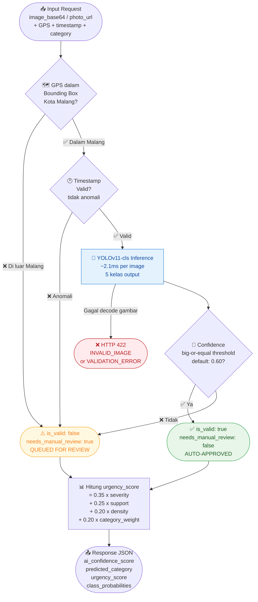

---

### Alur Prediksi Risiko

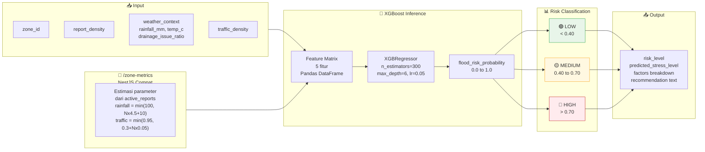

---

### Alur Policy Simulator

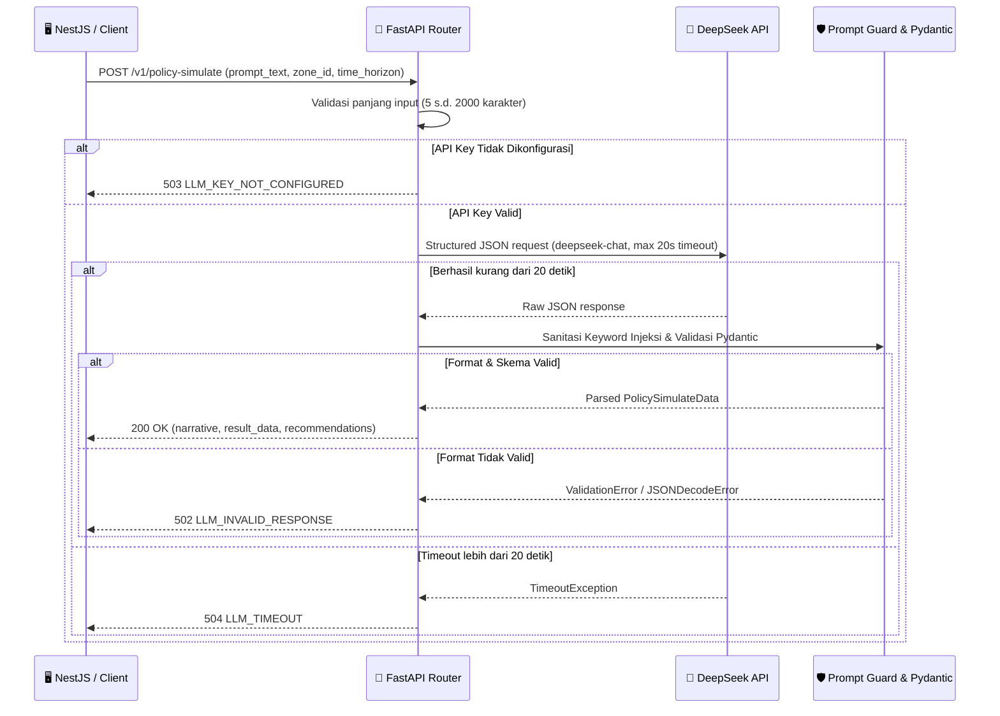

---

## 🧩 Teknologi Stack

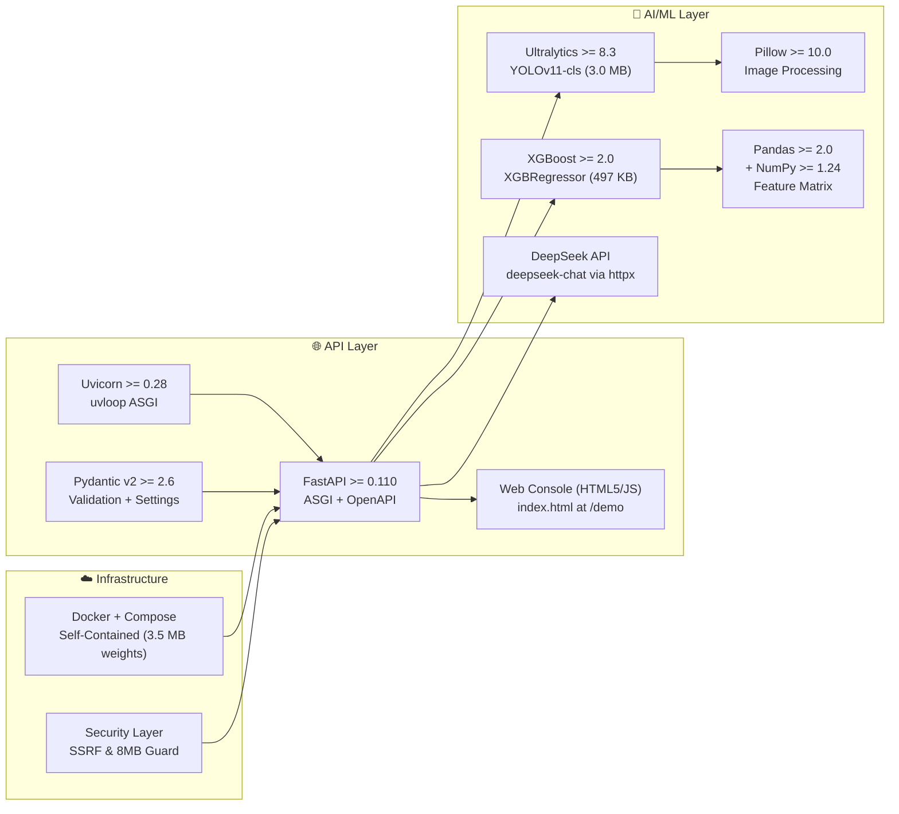

| Layer | Teknologi | Versi | Peran |
|---|---|---|---|
| Web Framework | **FastAPI** | `>=0.110.0` | ASGI routing, Pydantic validation, OpenAPI docs |
| ASGI Server | **Uvicorn** | `>=0.28.0` | Production ASGI server with uvloop |
| Interactive Console | **Vanilla JS + HTML5** | Modern Web | Interactive Console di `GET /` & `GET /demo` |
| Computer Vision | **Ultralytics YOLOv11** | `>=8.3.0` | Image classification (5-class, `-cls` mode) |
| ML Baseline | **XGBoost** | `>=2.0.0` | Risk regression (`XGBRegressor`) |
| LLM | **DeepSeek API** | `deepseek-chat` via `httpx` | Structured JSON policy simulation with injection guard |
| Async HTTP Client | **HTTPX** | `>=0.27.0` | Non-blocking async client for DeepSeek API |
| Image Processing | **Pillow** | `>=10.0.0` | Base64 decode, URL fetch, YOLO pre-processing |
| Data Processing | **Pandas + NumPy** | `>=2.0.0 / >=1.24.0` | XGBoost feature matrix |
| Validation | **Pydantic v2** | `>=2.6.0` | Schema + settings validation |
| Config | **Pydantic Settings** | `>=2.2.0` | Environment variables dari `.env` |
| Containerization | **Docker + Compose** | — | Self-contained deployment |

---

## 📁 Struktur Direktori Proyek

```
ai-service/
├── app/
│   ├── core/
│   │   ├── config.py               # Pydantic Settings — semua env variable
│   │   └── logging.py              # Logging setup (structlog / stdlib)
│   ├── routers/
│   │   ├── __init__.py
│   │   ├── verification.py         # /v1/verify (canonical) + /api/v1/verify (NestJS compat)
│   │   ├── prediction.py           # /v1/predict-risk + /v1/predict/zone-metrics
│   │   └── policy_simulator.py     # /v1/policy-simulate
│   ├── schemas/
│   │   ├── base.py                 # APIResponse[T], APIError, HealthStatusData, ModelsStatus
│   │   ├── verification.py         # VerifyReportRequest, VerifyReportData, VerifyReportNestJSData
│   │   ├── prediction.py           # PredictRiskRequest/Data, PredictZoneMetricsRequest/Data
│   │   └── policy_simulator.py     # PolicySimulateRequest, PolicySimulateData, PolicyProjectionData
│   ├── services/
│   │   ├── yolo_service.py         # Singleton YOLOv11 classifier (thread-safe, pre-warmed)
│   │   ├── xgboost_service.py      # Singleton XGBoost risk predictor
│   │   ├── deepseek_service.py     # DeepSeek LLM service with prompt injection guard
│   │   └── gemini_service.py       # Fallback LLM interface
│   ├── utils/
│   │   ├── security.py             # SSRF protection, IP resolver blocker, image validator
│   │   ├── gps_validator.py        # Malang bbox check + timestamp validation
│   │   └── scoring.py              # Smart Priority score calculation (Rules.md §1.3)
│   └── main.py                     # FastAPI app, lifespan, global error handlers, demo router
│
├── index.html                      # Interactive Web Console (Live Testing UI)
├── LIMITATIONS.md                  # Laporan batasan teknis ilmiah & kejujuran domain
├── training_report.md              # Metrik evaluasi riil YOLOv11 (99.23% leak-free test accuracy)
├── models/
│   ├── yolov11-cls-laporkita.pt    # Trained YOLOv11-cls model weights (5 classes, 3.0 MB)
│   └── xgboost-flood-risk.json     # Trained XGBoost regressor weights (497 KB)
│
├── scripts/
│   ├── rebuild_clean_dataset.py    # dHash <=8 clustering & video-grouping (LEAK-1 fix)
│   ├── train_yolo_classifier.py    # Training YOLOv11-cls + 180° rotation augmentation
│   ├── generate_synthetic_zone_data.py  # Synthetic dataset 6.000 sampel hidrologi
│   └── train_xgboost_model.py      # Training XGBoost + evaluasi
│
├── tests/
│   ├── test_health.py              # Health check + model readiness verification
│   ├── test_verification.py        # 9 test cases: 5 kelas, GPS, timestamp, category validation, fail-closed
│   ├── test_prediction.py          # 4 test cases: stress rendah/tinggi, boundary, fail-closed
│   ├── test_security.py            # 5 test cases: SSRF loopback/metadata, path traversal, >8MB size, concurrency
│   ├── test_policy_simulator.py    # 6 test cases: DeepSeek mock, 502 parse, 504 timeout, 503 key, injection guard
│   └── test_utils.py               # 7 test cases: GPS bbox, timestamp edge cases, scoring formula
│
├── dataset/
│   ├── train/                      # 1.796 gambar (70%), leak-free split
│   ├── val/                        # 383 gambar (15%), early stopping
│   └── test/                       # 390 gambar (15%), held-out final evaluation
│
├── dataset_report.md               # Dokumentasi lengkap sumber dataset, lisensi, distribusi
├── Architecture.md                 # Arsitektur teknis detail
├── Design.md                       # Design decisions & patterns
├── ERD.md                          # Entity Relationship Diagram
├── PRD.md                          # Product Requirements Document
├── Rules.md                        # Business rules & thresholds
│
├── Dockerfile                      # Single-stage, CPU PyTorch, model weights di-copy ke image
├── docker-compose.yml              # Stack orchestration + env injection
├── requirements.txt                # Pinned dependencies
├── pytest.ini                      # pytest asyncio configuration
├── .env.example                    # Template environment variables
└── README.md
```

**Dependensi antar modul:**

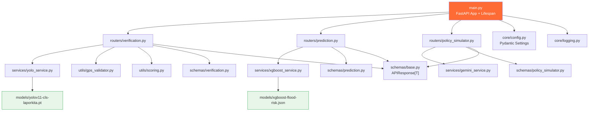

---

## 🚀 Cara Menjalankan Lokal (.venv)

**Prasyarat:** Python 3.11+, Git

```bash
# 1. Clone repository
git clone https://github.com/nabilkencana/AI-Service-LaporKita.git
cd AI-Service-LaporKita

# 2. Buat virtual environment
python3.11 -m venv .venv
source .venv/bin/activate       # macOS/Linux
# .venv\Scripts\activate        # Windows

# 3. Install dependensi
pip install --upgrade pip
pip install -r requirements.txt

# 4. Buat file .env dari template
cp .env.example .env
# Edit .env dan isi DEEPSEEK_API_KEY dengan API key dari https://platform.deepseek.com

# 5. Jalankan unit test (32 tests, 100% passing)
pytest -v

# 6. Jalankan server FastAPI
uvicorn app.main:app --host 0.0.0.0 --port 8000 --reload
```

> **⚠️ Perhatian:** Gunakan `app.main:app` (bukan `main:app`). Service memerlukan model weights di `models/yolov11-cls-laporkita.pt` (3.0 MB) dan `models/xgboost-flood-risk.json` (497 KB).

Setelah server aktif, buka:
- **Interactive Web Console (Demo UI):** `http://localhost:8000/demo` atau `http://localhost:8000/`
- **Swagger UI (Interaktif):** `http://localhost:8000/docs`
- **ReDoc (Dokumentasi):** `http://localhost:8000/redoc`
- **OpenAPI JSON Schema:** `http://localhost:8000/openapi.json`

---

## 🐳 Cara Menjalankan dengan Docker

Service dikemas sebagai container **mandiri** (*self-contained*) — model weights sudah ter-copy ke dalam image saat `docker build`.

### Lifecycle Container

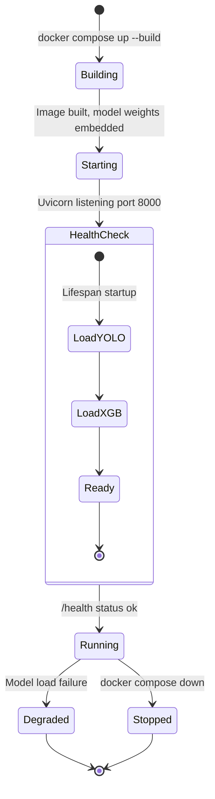

### Menggunakan Docker Compose (Rekomendasi)

```bash
# Jalankan di background
docker compose up -d

# Lihat log real-time
docker compose logs -f ai-service

# Hentikan service
docker compose down
```

### Build & Run Manual

```bash
# Build image
docker build -t laporkita-ai-service:1.0.0 .

# Jalankan container
docker run -d \
  --name laporkita-ai-service \
  -p 8000:8000 \
  -e DEEPSEEK_API_KEY=your_api_key_here \
  laporkita-ai-service:1.0.0
```

### Verifikasi Clean-State (Zero-State Test)

```bash
# 1. Bersihkan semua state lama
docker compose down -v

# 2. Build dan jalankan ulang dari nol
docker compose up --build -d

# 3. Verifikasi service aktif dan semua model loaded
curl -s http://localhost:8000/health | python3 -m json.tool
```

**Output yang diharapkan:**
```json
{
  "success": true,
  "data": {
    "status": "ok",
    "service": "ai-service",
    "version": "1.0.0",
    "environment": "production",
    "models": {
      "yolo_classification_loaded": true,
      "xgboost_risk_loaded": true,
      "gemini_configured": true
    }
  },
  "error": null
}
```

---

## ⚙️ Daftar Lengkap Environment Variables

Semua variabel dikonfigurasi melalui file `.env` (diload oleh Pydantic Settings dari `app/core/config.py`).

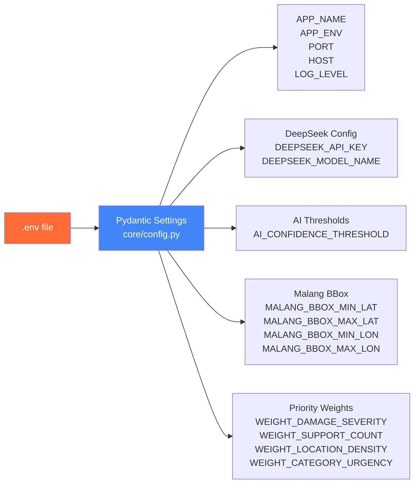

| Variabel | Tipe | Default | Wajib | Deskripsi |
|---|---|---|---|---|
| `APP_NAME` | `string` | `LaporKita AI Service` | Tidak | Nama aplikasi service |
| `APP_ENV` | `string` | `development` | Tidak | Environment mode (`development` / `production`) |
| `PORT` | `int` | `8000` | Tidak | Port listen server |
| `HOST` | `string` | `0.0.0.0` | Tidak | Host listen server |
| `LOG_LEVEL` | `string` | `INFO` | Tidak | Tingkat logging (`DEBUG`, `INFO`, `WARNING`, `ERROR`) |
| **— Model Paths —** | | | | |
| `CLASSIFICATION_MODEL_PATH` | `string` | `models/yolov11-cls-laporkita.pt` | **Ya** | Path ke file weights YOLOv11 |
| `XGBOOST_MODEL_PATH` | `string` | `models/xgboost-flood-risk.json` | **Ya** | Path ke file model XGBoost |
| **— DeepSeek LLM (Primary) —** | | | | |
| `DEEPSEEK_API_KEY` | `string` | `""` | **Ya** | API Key DeepSeek (dari [DeepSeek Platform](https://platform.deepseek.com)) |
| `DEEPSEEK_BASE_URL` | `string` | `https://api.deepseek.com` | Tidak | Base URL endpoint DeepSeek API |
| `DEEPSEEK_MODEL_NAME` | `string` | `deepseek-chat` | Tidak | Identifier model DeepSeek (default: `deepseek-chat`) |
| **— Gemini LLM (Optional Fallback) —** | | | | |
| `GEMINI_API_KEY` | `string` | `""` | Tidak | API Key Google Gemini (opsional) |
| `GEMINI_MODEL_NAME` | `string` | `gemini-2.5-flash` | Tidak | Identifier model Gemini |
| **— AI Verification Thresholds —** | | | | |
| `AI_CONFIDENCE_THRESHOLD` | `float` | `0.6` | Tidak | Ambang batas minimum confidence untuk auto-approve (`Rules.md §1.2`) |
| **— Kota Malang Bounding Box —** | | | | |
| `MALANG_BBOX_MIN_LAT` | `float` | `-8.0500` | Tidak | Batas selatan wilayah pilot (Kota Malang) |
| `MALANG_BBOX_MAX_LAT` | `float` | `-7.9000` | Tidak | Batas utara wilayah pilot |
| `MALANG_BBOX_MIN_LON` | `float` | `112.5500` | Tidak | Batas barat wilayah pilot |
| `MALANG_BBOX_MAX_LON` | `float` | `112.7000` | Tidak | Batas timur wilayah pilot |
| **— Smart Priority Weights —** | | | | |
| `WEIGHT_DAMAGE_SEVERITY` | `float` | `0.35` | Tidak | Bobot keparahan kerusakan (`Rules.md §1.3`) |
| `WEIGHT_SUPPORT_COUNT` | `float` | `0.25` | Tidak | Bobot dukungan/upvote warga |
| `WEIGHT_LOCATION_DENSITY` | `float` | `0.20` | Tidak | Bobot kepadatan laporan di wilayah |
| `WEIGHT_CATEGORY_URGENCY` | `float` | `0.20` | Tidak | Bobot urgensi kategori fasilitas |

---

## 🔀 Routing & URL Mapping (Dual-Prefix)

Service mendaftarkan router secara **dual-prefix** untuk mendukung dua klien berbeda:

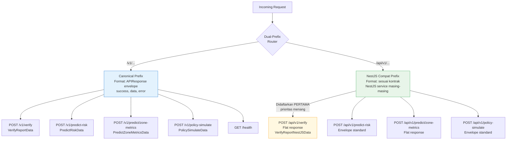

| Klien | URL Prefix | Format Response | Keterangan |
|---|---|---|---|
| **Canonical / Testing** | `/v1/...` | `{ success, data, error }` envelope standar | Untuk penggunaan langsung & testing |
| **NestJS Backend** | `/api/v1/...` | Sesuai kontrak masing-masing service | Terintegrasi dengan `backend-laporkita` |

> **Catatan Registrasi `/api/v1/verify`:** `verify_compat_router` didaftarkan **pertama** dan mengembalikan response **flat** tanpa envelope — menang karena prioritas registrasi router di FastAPI.

---

## 📡 Dokumentasi Lengkap Semua Endpoint

### 1. `GET /health`

Mengecek status kesehatan server dan kesiapan operasional semua model ML di memori.

- **URL:** `GET http://localhost:8000/health`
- **Auth:** Tidak diperlukan
- **Response Model:** `APIResponse[HealthStatusData]`

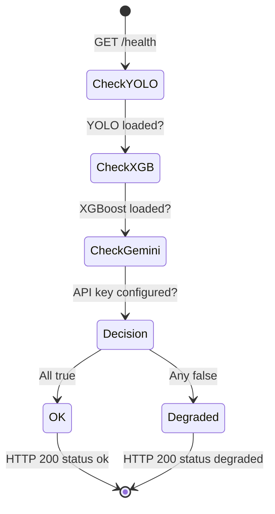

#### Response (HTTP 200 OK — Semua Model Siap):
```json
{
  "success": true,
  "data": {
    "status": "ok",
    "service": "ai-service",
    "version": "1.0.0",
    "environment": "development",
    "models": {
      "yolo_classification_loaded": true,
      "xgboost_risk_loaded": true,
      "gemini_configured": true
    }
  },
  "error": null
}
```

#### Response (HTTP 200 — Status `degraded` jika model gagal load):
```json
{
  "success": true,
  "data": {
    "status": "degraded",
    "models": {
      "yolo_classification_loaded": false,
      "xgboost_risk_loaded": true,
      "gemini_configured": true
    }
  },
  "error": null
}
```

---

### 2. `GET /demo` & `GET /` — Interactive Web Console

Antarmuka pengujian visual web interaktif (*glassmorphism UI*) untuk menguji verifikasi citra YOLOv11-cls, prediksi risiko XGBoost, dan simulasi kebijakan DeepSeek LLM secara langsung di browser tanpa Postman.

- **URL:** `GET http://localhost:8000/demo` atau `GET http://localhost:8000/`
- **Fitur Utama:**
  - 🕳️ **1-Click Presets Citra:** Uji cepat 5 kategori fasilitas publik dengan citra tersemat.
  - 🗺️ **GPS Malang Presets:** Alun-Alun, Suhat, Ijen, dan Luar Malang (Uji Fail-Closed).
  - 📊 **Visual Gauge & Breakdown:** Distribusi probabilitas Softmax, skor *Damage Severity*, dan dekomposisi *Smart Priority*.
  - 🤖 **DeepSeek Policy Sandbox:** Skenario cepat anggaran Kota Malang dengan output narasi eksekutif dan kartu metrik proyeksi.
- **Content-Type:** `text/html; charset=utf-8`

---

### 3. `POST /v1/verify` — Canonical (envelope)

Verifikasi laporan foto kerusakan fasilitas publik warga menggunakan YOLOv11-cls.

- **URL (Canonical):** `POST http://localhost:8000/v1/verify`
- **URL (Via NestJS proxy):** `POST http://localhost:8000/api/v1/verify` *(format berbeda, lihat endpoint #3)*
- **Content-Type:** `application/json`
- **Response Model:** `APIResponse[VerifyReportData]`

#### Pipeline Verifikasi (Rules.md §1.2):

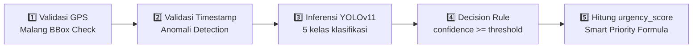

1. **Validasi GPS** → Koordinat dalam Bounding Box Kota Malang
2. **Validasi Timestamp** → Timestamp tidak anomali (terlalu lampau / masa depan)
3. **Inferensi YOLOv11-cls** → Klasifikasi ke 5 kelas
4. **Decision Rule:**
   - `confidence >= 0.6` **DAN** GPS valid **DAN** Timestamp valid → `is_valid: true, needs_manual_review: false`
   - Salah satu gagal → `is_valid: false, needs_manual_review: true` *(masuk antrean review operator, **bukan ditolak**)*
5. **Hitung Smart Priority** `urgency_score` (Rules.md §1.3)

#### Request Body:
```json
{
  "image_base64": "/9j/4AAQSkZJRgABAQAAAQABAAD...",
  "claimed_category": "Jalan Berlubang",
  "latitude": -7.9826,
  "longitude": 112.6308,
  "timestamp": "2026-08-23T02:00:00Z"
}
```

**Field Aliases (diterima dari NestJS backend-laporkita):**

| Field Standar | Alias NestJS | Keterangan |
|---|---|---|
| `image_url` | `photo_url` | URL publik / pre-signed gambar |
| `claimed_category` | `reported_category` | Kategori dipilih pengguna |
| `timestamp` | `created_at` | Timestamp laporan dibuat |

> **Catatan:** Kirim `image_url` ATAU `image_base64` (minimal salah satu wajib ada).

#### Response (HTTP 200 — Terverifikasi Otomatis):
```json
{
  "success": true,
  "data": {
    "ai_confidence_score": 1.0,
    "predicted_category": "Jalan Berlubang",
    "is_valid": true,
    "needs_manual_review": false,
    "damage_severity": 0.96,
    "urgency_score": 0.536,
    "description_auto": "Terdeteksi kerusakan permukaan aspal/jalan berlubang dengan estimasi keparahan 96% (keyakinan AI 100%). Memerlukan penambalan perkerasan jalan.",
    "gps_valid": true,
    "timestamp_valid": true,
    "class_probabilities": {
      "Drainase": 0.0,
      "Jalan Berlubang": 1.0,
      "Lampu Jalan": 0.0,
      "Rambu Lalu Lintas": 0.0,
      "Trotoar": 0.0
    },
    "_placeholder": false
  },
  "error": null
}
```

#### Response (HTTP 200 — Perlu Review Manual, GPS di luar Malang):
```json
{
  "success": true,
  "data": {
    "ai_confidence_score": 0.9812,
    "predicted_category": "Trotoar",
    "is_valid": false,
    "needs_manual_review": true,
    "damage_severity": 0.86,
    "urgency_score": 0.451,
    "description_auto": "Terdeteksi kerusakan jalur pejalan kaki/trotoar beton dengan estimasi keparahan 86% (keyakinan AI 98%). Memerlukan perbaikan struktur trotoar.",
    "gps_valid": false,
    "timestamp_valid": true,
    "class_probabilities": { "Trotoar": 0.9812 },
    "_placeholder": false
  },
  "error": null
}
```

#### Response Error (HTTP 422 — Gambar Tidak Dapat Dibaca):
```json
{
  "success": false,
  "data": null,
  "error": {
    "code": "INVALID_IMAGE",
    "message": "Gambar tidak dapat dimuat: format base64 tidak valid atau file corrupt"
  }
}
```

#### Formula `urgency_score` (Smart Priority — Rules.md §1.3):

```
urgency_score = (0.35 × damage_severity)
              + (0.25 × support_count_normalized)
              + (0.20 × location_density_factor)
              + (0.20 × category_urgency_weight)
```

Nilai `category_urgency_weight` per kategori:

| Kategori | Bobot Urgensi | Alasan |
|---|---|---|
| 🔴 Jalan Berlubang | **0.90** | Risiko kecelakaan langsung |
| 🟠 Drainase | **0.85** | Risiko banjir dan genangan |
| 🟡 Rambu Lalu Lintas | **0.80** | Risiko keselamatan lalu lintas |
| 🟢 Lampu Jalan | **0.70** | Risiko keamanan malam hari |
| 🔵 Trotoar | **0.65** | Risiko pejalan kaki |

---

### 3. `POST /api/v1/verify` — NestJS Compat (flat)

Endpoint kompatibilitas khusus untuk `backend-laporkita` (NestJS). Menggunakan **pipeline inferensi yang sama** dengan endpoint canonical, namun mengembalikan response **flat** (tanpa wrapper envelope) sesuai kontrak `ai-verification.service.js`.

- **URL:** `POST http://localhost:8000/api/v1/verify`
- **Content-Type:** `application/json`
- **Response Model:** `VerifyReportNestJSData` (flat, tanpa `success`/`error` wrapper)

#### Request Body:
```json
{
  "photo_url": "https://storage.laporkita.id/reports/abc123.jpg",
  "reported_category": "Drainase",
  "latitude": -7.9826,
  "longitude": 112.6308,
  "created_at": "2026-08-23T02:00:00Z"
}
```

#### Response (HTTP 200 — Flat):
```json
{
  "confidence": 0.9999,
  "category": "Drainase",
  "is_valid_gps": true,
  "is_valid_timestamp": true,
  "damage_severity": 0.94,
  "reason": "Lolos verifikasi otomatis (AI confidence >= threshold, GPS dan timestamp valid)",
  "is_mock": false
}
```

---

### 4. `POST /v1/predict-risk`

Memprediksi probabilitas risiko genangan air dan tingkat stres wilayah menggunakan XGBoost baseline.

- **URL (Canonical):** `POST http://localhost:8000/v1/predict-risk`
- **URL (NestJS):** `POST http://localhost:8000/api/v1/predict-risk`
- **Content-Type:** `application/json`
- **Response Model:** `APIResponse[PredictRiskData]`

#### Request Body:
```json
{
  "zone_id": "zone-klojen-01",
  "report_density": 25,
  "weather_context": {
    "rainfall_mm": 65.0,
    "temperature_c": 23.5,
    "condition": "Hujan Lebat",
    "drainage_issue_ratio": 0.45
  },
  "traffic_density": 0.8
}
```

| Field | Tipe | Wajib | Rentang | Deskripsi |
|---|---|---|---|---|
| `zone_id` | `string` | Tidak | — | UUID zona urban (ERD.md §2.11) |
| `report_density` | `int` | Tidak (default: 0) | `>= 0` | Jumlah laporan aktif di zona |
| `weather_context.rainfall_mm` | `float` | Tidak (default: 0.0) | `>= 0.0` | Curah hujan dalam milimeter |
| `weather_context.temperature_c` | `float` | Tidak (default: 27.0) | — | Suhu ambient dalam Celsius |
| `weather_context.drainage_issue_ratio` | `float` | Tidak (default: 0.2) | `0.0–1.0` | Rasio laporan drainase terhadap total laporan |
| `traffic_density` | `float` | Tidak (default: 0.5) | `0.0–1.0` | Tingkat kemacetan ternormalisasi |

#### Response (HTTP 200 — Risiko Tinggi):
```json
{
  "success": true,
  "data": {
    "flood_risk_probability": 0.8421,
    "risk_level": "high",
    "predicted_stress_level": "high",
    "factors": {
      "rainfall_impact": 0.65,
      "report_density_impact": 0.625,
      "traffic_congestion_impact": 0.8,
      "drainage_vulnerability_impact": 0.45
    },
    "recommendation": "STATUS WASPADA: Probabilitas genangan tinggi terdeteksi (Curah hujan: 65.0 mm, 25 laporan aktif). Direkomendasikan pengerahan pompa bergerak DPUPR dan pengalihan rute lalu lintas oleh Dishub.",
    "_placeholder": false
  },
  "error": null
}
```

#### Response (HTTP 200 — Risiko Rendah):
```json
{
  "success": true,
  "data": {
    "flood_risk_probability": 0.2134,
    "risk_level": "low",
    "predicted_stress_level": "low",
    "factors": {
      "rainfall_impact": 0.05,
      "report_density_impact": 0.025,
      "traffic_congestion_impact": 0.2,
      "drainage_vulnerability_impact": 0.1
    },
    "recommendation": "Kondisi wilayah normal. Pemantauan rutin DPUPR cukup memadai.",
    "_placeholder": false
  },
  "error": null
}
```

**Level Risiko:**

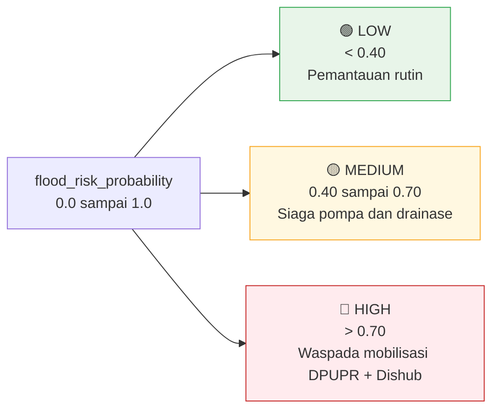

---

### 5. `POST /v1/predict/zone-metrics` — NestJS Compat

Endpoint kompatibilitas khusus untuk NestJS `prediction.service.js`. Menerima input sederhana (`zone_id`, `active_reports`) dan secara internal mengestimasikan parameter cuaca dari jumlah laporan aktif, lalu menjalankan XGBoost inference yang sama.

- **URL (Canonical):** `POST http://localhost:8000/v1/predict/zone-metrics`
- **URL (NestJS):** `POST http://localhost:8000/api/v1/predict/zone-metrics`
- **Content-Type:** `application/json`
- **Response Model:** `PredictZoneMetricsData` (flat, tanpa envelope)

#### Request Body:
```json
{
  "zone_id": "b2c3d4e5-f6a7-8901-bcde-f01234567890",
  "zone_name": "Klojen Pusat",
  "active_reports": 18
}
```

#### Response (HTTP 200):
```json
{
  "report_density": 18,
  "traffic_density": 0.72,
  "flood_risk_probability": 0.7123,
  "weather_context": {
    "source": "BMKG Kota Malang (Simulasi)",
    "temperature_celsius": 24.5,
    "humidity_percentage": 82.0,
    "rainfall_mm": 91.0,
    "condition": "Hujan Deras"
  },
  "stress_level": "high"
}
```

> **Catatan Internal:** `rainfall_mm` diestimasi dengan rumus `min(100, active_reports × 4.5 + 10)` dan `traffic_density` dengan `min(0.95, 0.3 + active_reports × 0.05)`.

---

### 7. `POST /v1/policy-simulate`

Mensimulasikan skenario intervensi kebijakan pemerintah kota menggunakan DeepSeek API (`deepseek-chat`) dengan output JSON terstruktur yang divalidasi oleh Pydantic serta diproteksi dari injeksi teks.

- **URL (Canonical):** `POST http://localhost:8000/v1/policy-simulate`
- **URL (NestJS):** `POST http://localhost:8000/api/v1/policy-simulate`
- **Content-Type:** `application/json`
- **Response Model:** `APIResponse[PolicySimulateData]`
- **Timeout:** 20 detik (DeepSeek API)

#### Request Body:
```json
{
  "prompt_text": "Bagaimana proyeksi dampak jika Pemkot Malang mengalokasikan anggaran Rp 1.5 Miliar untuk normalisasi gorong-gorong di sepanjang koridor Jalan Soekarno-Hatta menjelang musim hujan?",
  "zone_id": "zone-lowokwaru-suhat",
  "time_horizon_months": 6,
  "parameters": {
    "allocated_budget_idr": 1500000000,
    "target_district": "Lowokwaru",
    "priority_facility": "Drainase"
  }
}
```

| Field | Tipe | Wajib | Batasan | Deskripsi |
|---|---|---|---|---|
| `prompt_text` | `string` | **Ya** | `5–2000 karakter` | Skenario kebijakan yang diajukan |
| `zone_id` | `string` | Tidak | — | UUID zona target jika simulasi terlokalisir |
| `time_horizon_months` | `int` | Tidak (default: 6) | `1–60` | Durasi simulasi dalam bulan |
| `parameters` | `object` | Tidak | — | Parameter tambahan (anggaran, tipe intervensi, dll.) |

#### Response (HTTP 200 — Berhasil):
```json
{
  "success": true,
  "data": {
    "result_narrative": "Koridor Jalan Soekarno-Hatta di Kecamatan Lowokwaru merupakan salah satu arteri vital Kota Malang yang sering mengalami permasalahan genangan air saat musim hujan...",
    "result_data": {
      "estimated_incident_reduction_pct": 65.0,
      "budget_estimate_idr": 1500000000.0,
      "time_to_impact_weeks": 10,
      "target_department": "Dinas Pekerjaan Umum, Penataan Ruang, Perumahan dan Kawasan Permukiman (DPUPRPKP) Kota Malang",
      "public_satisfaction_increase_pct": 45.0,
      "risk_mitigations": [
        "Manajemen lalu lintas dan sosialisasi rute alternatif selama pengerjaan.",
        "Penanganan dan pembuangan sedimen hasil pengerukan sesuai standar lingkungan."
      ]
    },
    "key_recommendations": [
      "Melakukan monitoring dan evaluasi berkala terhadap kinerja drainase pasca-normalisasi.",
      "Menggalakkan program edukasi pengelolaan sampah agar tidak membuang ke saluran air.",
      "Mengintegrasikan data curah hujan dan sistem peringatan dini banjir."
    ],
    "model_used": "deepseek-chat",
    "_placeholder": false
  },
  "error": null
}
```

#### Response Error (HTTP 503 — API Key Belum Dikonfigurasi):
```json
{
  "success": false,
  "data": null,
  "error": {
    "code": "LLM_KEY_NOT_CONFIGURED",
    "message": "DeepSeek / LLM API Key belum dikonfigurasi di environment server."
  }
}
```

#### Response Error (HTTP 504 — DeepSeek Timeout):
```json
{
  "success": false,
  "data": null,
  "error": {
    "code": "LLM_TIMEOUT",
    "message": "Permintaan simulasi kebijakan ke LLM API melebihi batas waktu (20 detik)."
  }
}
```

#### Response Error (HTTP 502 — Format Tidak Valid dari LLM):
```json
{
  "success": false,
  "data": null,
  "error": {
    "code": "LLM_INVALID_RESPONSE",
    "message": "Output dari LLM API bukan merupakan format JSON yang valid."
  }
}
---

## 📐 Format Response Envelope Standar

Semua endpoint canonical (`/v1/...`) menggunakan format response envelope standar (`Rules.md §3`):

**Success:**
```json
{
  "success": true,
  "data": { "..." },
  "error": null
}
```

**Error:**
```json
{
  "success": false,
  "data": null,
  "error": {
    "code": "ERROR_CODE",
    "message": "Deskripsi error yang jelas",
    "details": []
  }
}
```

> **Catatan:** Endpoint NestJS Compat (`/api/v1/verify`, `/v1/predict/zone-metrics`) mengembalikan format **flat** tanpa envelope sesuai kontrak NestJS.

---

## 🚨 Error Codes & HTTP Status Reference

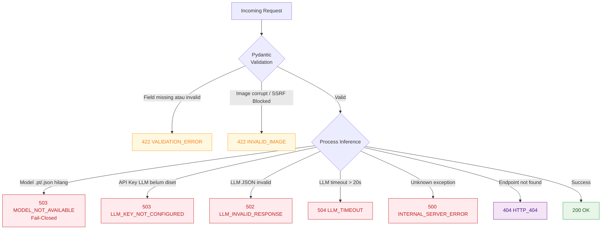

| HTTP Status | Error Code | Trigger |
|---|---|---|
| `200` | — | Sukses memproses inferensi |
| `422` | `VALIDATION_ERROR` | Field wajib tidak ada, rentang nilai salah, atau format tidak valid |
| `422` | `INVALID_IMAGE` | Gambar tidak dapat dibaca (corrupt, base64 invalid, atau diblokir SSRF) |
| `503` | `MODEL_NOT_AVAILABLE` | Bobot model YOLOv11/XGBoost belum dimuat (kebijakan Fail-Closed MOCK-1) |
| `503` | `LLM_KEY_NOT_CONFIGURED` | API Key DeepSeek belum diset di `.env` (kebijakan LAT-POL) |
| `502` | `LLM_INVALID_RESPONSE` | DeepSeek mengembalikan format yang tidak dapat divalidasi skema Pydantic |
| `504` | `LLM_TIMEOUT` | DeepSeek API tidak merespons dalam batas waktu 20 detik |
| `500` | `INTERNAL_SERVER_ERROR` | Error tidak terduga di sisi server |
| `404` | `HTTP_404` | Endpoint tidak ditemukan |

---

## 📊 Ringkasan Dataset Publik (5 Kategori)

Rincian lengkap, URL verifikasi, dan analisis domain gap didokumentasikan di [`dataset_report.md`](dataset_report.md).

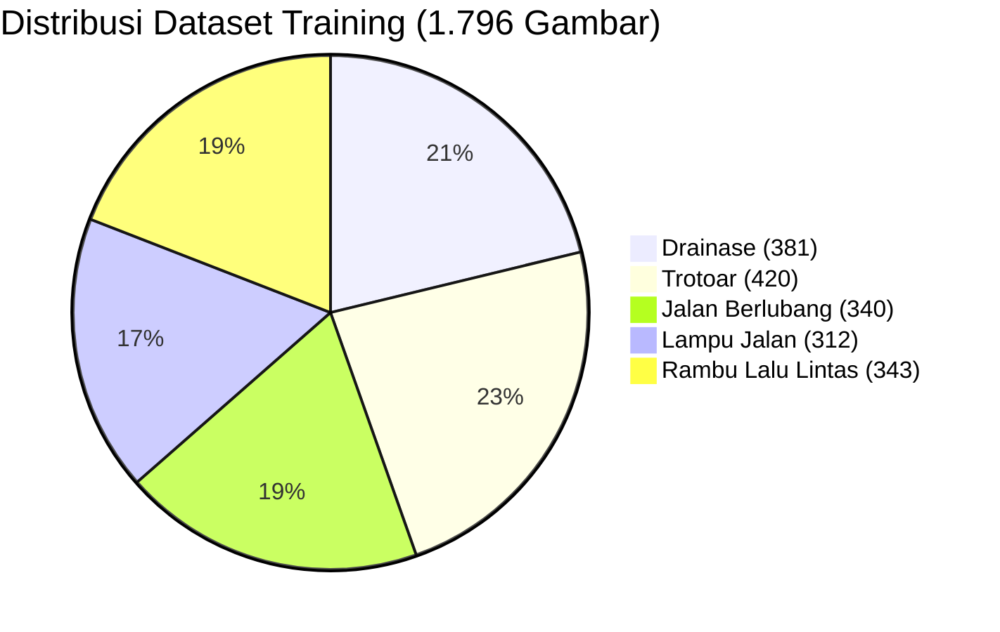

| Kategori LaporKita | Dataset Publik | Sumber | Lisensi | Clean | Train (70%) | Val (15%) | Test (15%) |
|---|---|---|---|---|---|---|---|
| **🔴 Jalan Berlubang** | Roboflow Pothole / RDD2022 | [HuggingFace](https://huggingface.co/datasets/keremberke/pothole-segmentation) | CC BY 4.0 | **486** | 340 | 72 | 74 |
| **🔵 Trotoar** | METU Concrete Crack Images (CCIC) | [Mendeley Data](https://data.mendeley.com/datasets/5y9wdsg2zt/2) | CC BY 4.0 | **600** | 420 | 90 | 90 |
| **🟡 Rambu Lalu Lintas** | German Traffic Sign Detection (GTSDB) | [HuggingFace](https://huggingface.co/datasets/keremberke/german-traffic-sign-detection) | CC BY 4.0 | **491** | 343 | 73 | 75 |
| **🟠 Lampu Jalan** | Team16 Street Light Dataset | [GitHub](https://github.com/Team16Project/Street-Light-Dataset) | MIT | **447** | 312 | 67 | 68 |
| **🟤 Drainase** | Manhole Covers & Storm Drains | [HuggingFace](https://huggingface.co/datasets/delima87/manhole_covers_dataset) | CC BY 4.0 | **545** | 381 | 81 | 83 |
| **TOTAL** | | | | **2.569** | **1.796** | **383** | **390** |

**Stratified Split 70 / 15 / 15:**

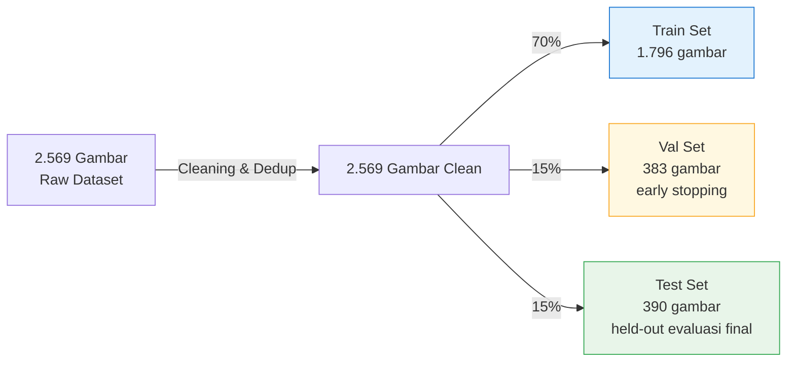

---

## 📈 Metrik Evaluasi Model Riil

### A. YOLOv11-cls Computer Vision (Test Set: 390 Citra, Leak-Free Held-Out)

*Evaluasi dijalankan pada held-out test set independen bebas kebocoran (`dataset/test/`) paska-resolusi LEAK-1.*

| Metrik | Nilai |
|---|---|
| **Top-1 Accuracy** | **99.23%** (387/390 benar) |
| **Macro Average F1-Score** | **99.23%** |
| **Kecepatan Inferensi (MPS GPU)** | **~0.6–2.9 ms / citra** (API End-to-End: ~30–115ms) |
| **Model Architecture** | `yolo11n-cls` (Nano Classifier) |
| **Training Data** | 1.796 citra (70% leak-free group split) |
| **Pretrained From** | ImageNet (Transfer Learning) |

**Per-Class Precision / Recall / F1:**

| Kategori Fasilitas | Precision | Recall | F1-Score | Support (Test) |
|---|---|---|---|---|
| **Drainase** | 0.9762 | 0.9880 | **0.9820** | 83 |
| **Jalan Berlubang** | 1.0000 | 0.9730 | **0.9863** | 74 |
| **Lampu Jalan** | 1.0000 | 1.0000 | **1.0000** | 68 |
| **Rambu Lalu Lintas** | 0.9868 | 1.0000 | **0.9934** | 75 |
| **Trotoar** | 1.0000 | 1.0000 | **1.0000** | 90 |
| **Macro Average** | **0.9926** | **0.9922** | **0.9923** | **390** |

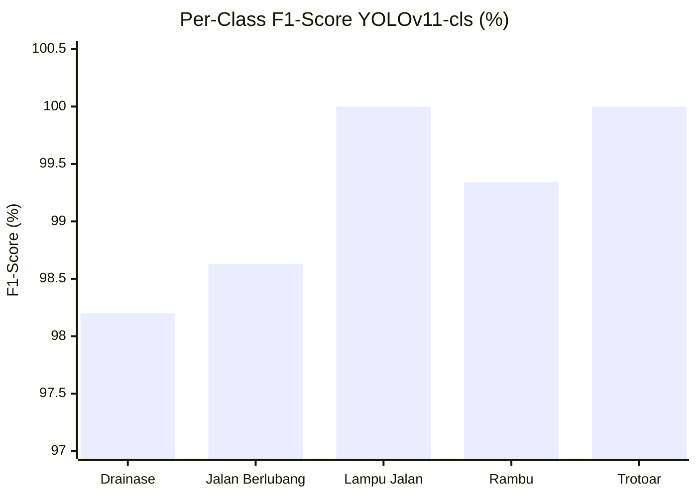

*Laporan evaluasi mendalam (confusion matrix, per-class error analysis, training curves) tersedia di [`training_report.md`](training_report.md) dan laporan batasan di [`LIMITATIONS.md`](LIMITATIONS.md).*

---

### B. XGBoost Risk Prediction (Test Set: 1.200 Sampel Sintetis — Baseline)

*Evaluasi pada 20% held-out dari total 6.000 sampel dataset sintetis hidrologi perkotaan (Self-Consistency Baseline).*

| Metrik | Nilai | Interpretasi |
|---|---|---|
| **R² Score (Sintetis)** | **0.9635** | Model merefleksikan 96.35% variansi formula sintetis baseline |
| **RMSE** | **0.0490** | Rata-rata deviasi probabilitas ±4.90% |
| **MAE** | **0.0369** | Rata-rata deviasi probabilitas ±3.69% |
| **Model Architecture** | `XGBRegressor` | `n_estimators=300, max_depth=6, learning_rate=0.05` |
| **Training Data** | 4.800 sampel sintetis | 80% dari 6.000 sampel hidrologi sintetis |

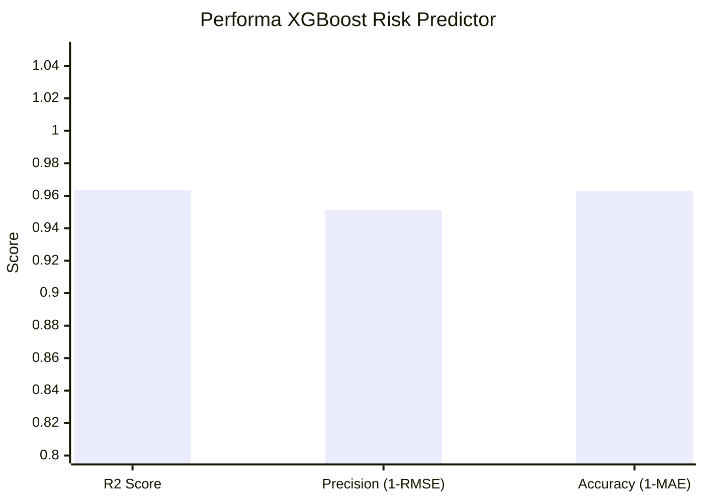

---

## 🏗️ Arsitektur Decision Log

Keputusan teknis utama yang dibuat selama pengembangan:

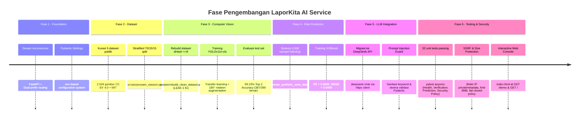

| Keputusan | Pilihan | Alternatif Dipertimbangkan | Alasan |
|---|---|---|---|
| **Model klasifikasi** | `yolo11n-cls` (Nano) | CLIP, MobileNet, ResNet50 | Ekosistem Ultralytics mature, inference ~2ms, mudah di-retrain dengan foto lokal |
| **Deployment model** | Weights di-copy ke Docker image | Volume mount dari host | Container benar-benar mandiri (*self-contained*), tidak ada external dependency saat runtime |
| **Dockerfile** | Single-stage CPU PyTorch | Multi-stage build | Multi-stage gagal karena Docker Desktop memory limit saat download CUDA packages (>1GB); CPU cukup untuk inference |
| **Dataset strategi** | Public datasets + proxy visual | Scraping foto laporan lokal | Zero foto lapangan Kota Malang tersedia; proxy public datasets memungkinkan training langsung dijalankan |
| **Data historis XGBoost** | Sintetis (aturan hidrologi) | BMKG API + laporan DPUPR | Data historis riil belum tersedia; synthetic data cukup untuk demo dengan pola prediksi yang masuk akal |
| **Dual-prefix routing** | `/v1/...` + `/api/v1/...` | Satu prefix saja | NestJS backend memanggil `/api/v1/...`; prefix canonical `/v1/...` dipertahankan untuk backward compatibility dan testing |
| **NestJS compat response** | Flat schema terpisah (`VerifyReportNestJSData`) | Transform di NestJS | Menghindari parsing ganda di NestJS layer; AI Service bertanggung jawab penuh atas format yang dikonsumsinya |

---

## ⚠️ Disclaimer & Known Limitations (Produksi)

Untuk keterbukaan teknis (*technical honesty*) sebelum deployment ke production sesungguhnya:

### 1. Domain Shift — Zero Field Validation Kota Malang

```mermaid
graph LR
    TrainData["Training Data\nDataset Publik Internasional"]
    FieldData["Field Data\nFoto Warga Malang"]
    Gap["⚠️ DOMAIN GAP\nSudut foto tidak ideal\nKamera resolusi rendah\nPencahayaan ekstrem\nTampilan fisik berbeda"]

    TrainData -->|"99.23% Test Acc"| ModelPerf["Model Performance\npada test set publik"]
    FieldData --> Gap --> ActualPerf["Performa Aktual\nBELUM DIVALIDASI"]
    ModelPerf -.->|"Mungkin berbeda signifikan"| ActualPerf

    style Gap fill:#FFEBEE,stroke:#C62828,color:#B71C1C
    style ActualPerf fill:#FFF8E1,stroke:#F9A825,color:#F57F17
```

Model YOLOv11 dievaluasi pada held-out test set dari dataset publik bebas kebocoran (akurasi **99.23%**). **Belum ada validasi dengan foto lapangan warga asli Kota Malang.**

> **Rekomendasi:** Lakukan labeling **200–500 foto lapangan warga Malang per kategori** dan fine-tune model sebelum production launch. Dokumentasi lengkap limitasi teknis tersedia di [`LIMITATIONS.md`](LIMITATIONS.md).

---

### 2. Kategori Proxy Visual

| Kategori | Dataset yang Digunakan | Gap Representasi |
|---|---|---|
| **Trotoar** | Concrete Crack Images (pelat beton) | Belum mencakup paving block warna, trotoar tanah, kanstin rusak |
| **Drainase** | Manhole covers & grill saluran air | Belum mencakup parit terbuka, selokan batu bata, saluran lahan sawah |
| **Rambu Lalu Lintas** | GTSDB (standar Eropa) | Piktogram minor berbeda dari rambu Dishub/Kemenhub RI |

---

### 3. Data Historis XGBoost Sintetis

Model XGBoost dilatih pada **6.000 sampel sintetis** yang dihasilkan berdasarkan aturan hidrologi perkotaan logistik (`scripts/generate_synthetic_zone_data.py`). Dataset ini **BUKAN data observasi riil**.

> **WAJIB di-retrain** dengan data historis riil (deret waktu curah hujan stasiun BMKG Karangploso + log penanganan fisik DPUPR Kota Malang) sebelum digunakan untuk pengambilan keputusan anggaran atau kebijakan publik yang sesungguhnya.

---

### 4. Metrik `damage_severity` sebagai Proxy

Nilai `damage_severity` (0.0–1.0) adalah **estimasi terkalibrasi** dari confidence model klasifikasi dan bobot urgensi kelas per kategori. Ini **bukan pengukuran langsung** luas fisik kerusakan per meter persegi. Untuk kuantifikasi kerusakan yang akurat, diperlukan model segmentasi (SAM/Mask R-CNN) atau survei fisik lapangan.

---

<div align="center">

**LaporKita AI Service** — Powered by YOLOv11, XGBoost & DeepSeek LLM

*Built for Kota Malang · MAGEITS Competition 2026*

</div>
